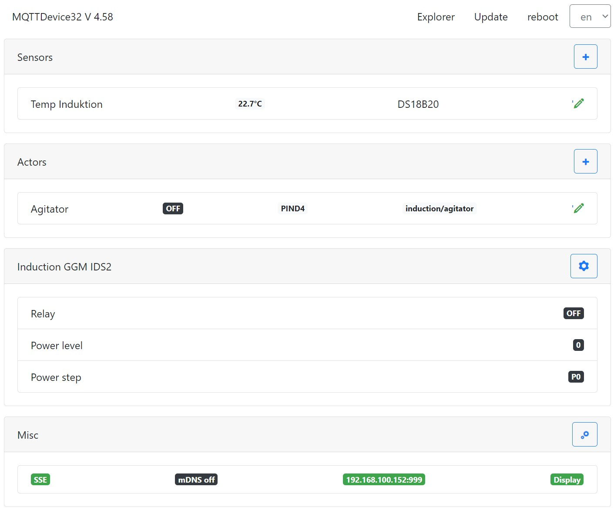

# MQTTDevice32

MQTTDevice32 is a port to ESP32 D1 from MQTTDevice4 ESP8266. MQTTDevice32 offers more GPIOs, faster CPU and multi language support. MQTTDevice32 enables sensors, actors and an induction hob to be connected via WLAN to [CraftBeerPi V4](https://github.com/avollkopf/craftbeerpi4).

MQTTDevice32 is an Arduino sketch for the ESP32 D1 mini modules. This makes it possible to establish communication between the MQTT broker (eg mosquitto) and an ESP32 in order to control sensors and actors with CraftBeerPi V4.

## 📚 Dokumentation

A detailed documentation is available on github pages: <https://innuendopi.gitbook.io/mqttdevice32/>
A detailed documentation CraftbeerPi4 is available on github pages:: <https://openbrewing.gitbook.io/craftbeerpi4_support/>

## ▶️ Installation ESP32

* Download [Firmeware.zip](https://github.com/InnuendoPi/MQTTDevice32/blob/main/tools/Firmware.zip)
* unzip Firmware.zip
* edit Flashen.cmd:
* change "COM3" in line 6 und line 8 "esptool.exe -p COM3" as you need
* open command line (cmd.exe) and change into firmware.zip directory
* start script "flashen.cmd"

Script flashen.cmd use [esptool](https://github.com/espressif/esptool).

## 🗺️ Multilingual

MQTTDevice32 supports (almost) any number of languages. Each language has its own language file. The language files in JSON format are stored in the folder data/language.

_Supported the project and translated the Brautomat into a new language or corrected existing language files!_

## GPIO mapping

The ESP32 D1 offers a pinout suitable for the ESP8266 (GPIO D0 to D8). The pin assignment shown is based on the ESP32 D1 Mini NodeMCU module from [AZ-Delivery](https://www.az-delivery.de/products/esp32-d1-mini)

GPIO mapping:

| Bezeichner |   GPIO   |  Input  |  Output  | Beschreibung |
| ---------- | -------- | ------- | -------- | ------------ |
|     D0     |  GPIO026 |   ok    |   ok     |              |
|     D1     |  GPIO022 |   ok    |   ok     |              |
|     D2     |  GPIO021 |   ok    |   ok     |              |
|     D3     |  GPIO017 |   ok    |   ok     |              |
|     D4     |  GPIO016 |   ok    |   ok     |              |
|     D5     |  GPIO018 |   ok    |   ok     |              |
|     D6     |  GPIO019 |   ok    |   ok     |              |
|     D7     |  GPIO023 |   ok    |   ok     |              |
|     D8     |  GPIO005 |   ok    |   ok     | CS5          |
|     D9     |  GPIO027 |   ok    |   ok     | SCLK         |
|     D10    |  GPIO025 |   ok    |   ok     | MISO         |
|     D11    |  GPIO032 |   ok    |   ok     | MOSI         |
|     D12    |  GPIO012 |  (ok)   |   ok     | TDI, boot fails if pulled high, strapping pin |
|     D13    |  GPIO004 |   ok    |   ok     | CS0         |
|     D14    |  GPIO000 | pullUp  |  (ok)    | must be low to enter flash mode |
|     D15    |  GPIO002 |   ok    |   ok     | onboard LED, must be low to enter flash mode |
|     D16    |  GPIO033 |   ok    |   ok     | CS1          |
|     D17    |  GPIO014 |   ok    |   ok     | CS2          |
|     D18    |  GPIO015 |   ok    |   ok     | CS3          |
|     D19    |  GPIO013 |   ok    |   ok     | CS4          |

Pins connected to onboard flash and not recommended for GPIO use:
CMD (IO11), CLK (IO6), SD0/SDD (IO7), SD1 (IO8), SD2 (IO9) and SD3 (IO10)

## Sketch Information

ESP32 Arduino 2.0.14\
VSCode 1.84 Arduino 0.6\
VSCode plugin ESP8266Littlefs based on VSCode plugin ESP8266fs\
InnuTicker task scheduler lib\
InnuFramework CSS/JS bootstrap 4.6.2\
Server Sent Events (8 SSE channels)
