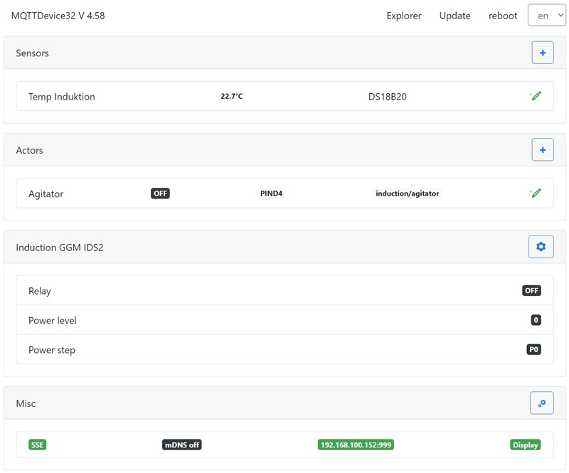

# MQTTDevice32

MQTTDevice32 ist ein Arduino Sketch für Wemos ESP32 D1 mini Module. Mit dem MQTTDevice32 können Sensoren, Aktoren und das Induktionskochfeld GGM IDS2 über WLAN mit [CraftBeerPi V4](https://github.com/avollkopf/craftbeerpi4) verbunden werden. MQTTDevice32 unterstützt mehr Aktoren und sensoren und eine schnellere CPU als das MQTTDevice4.

## ✅ Features

* Web Interface (WebIf)
* Backup und Restore der Konfiguration
* Server Sent Events (SSE) für WebClients
* Temperatursensoren
  * Dallas DS18B20 Sensoren (digital)
    * Suchfunktion für Dallas DS18B20 OneWire Sensoren
  * PT100 und PT1000 Sensoren (analog)
    * MAX31865 Amplifyer
  * MQTTDevice32 unterstützt bis zu 6 Sensoren
  * MQTTDevice4 supports unterstützt bis zu 3 Sensoren
* Aktoren
  * GPIO Auswahl
  * belegte GPIOs werden in der Auswahl ausgeblendet
  * GPIO invertieren
  * Einfaches PWM: Aktoren können auf 0 bis 100% Leistung eingestellt werden. Das MQTTDevice takten im Zyklus von 1000ms
  * MQTTDevice32 unterstützt bis zu 15 Aktoren
  * MQTTDevice4 unterstützt bis zu 10 Aktoren
* Induktionskochfeld
  * Induktionskochfeld GGM IDS2 wird direkt gesteuert
* Nextion HMI Touchdisplay Unterstützung
* Akkustische Signale
* WebUpdate Firmware
* DateiUpdate Firmware
* mDNS Support
* Event handling
* Dateiexplorer
* Unterstützung für versch. Sprachen

## 📚 Dokumentation

Beschreibung & Anleitung: [Anleitung](https://innuendopi.gitbook.io/mqttdevice32/)

## ▶️ Installation ESP32

* Download [Firmeware.zip](https://github.com/InnuendoPi/MQTTDevice32/blob/main/tools/Firmware.zip)
* Firmware.zip entpacken
* Flashen.cmd editieren:
* "COM3" in Zeile 6  und Zeile 8"esptool.exe -p COM3" anpassen
* Eingabeaufforderung (cmd.exe) öffnen und in das Verzeichnis von firmware.zip wechseln
* Firmware auf ESP32 ladeen mit "flashen.cmd"

Das Script flashen.cmd verwendet [esptool](https://github.com/espressif/esptool) (im ZIP Archiv enthalten).

## 🗺️ Multilingual

Das MQTTDevice unterstützt nahezu beliebig viele Sprachen. Jede Sprache hat eine eigene Sprachdatei. Die Sprachdateien im JSON Format sind im data Ordner gespeichert.

_Unterstütze das Projekt und übersetze das MQTTDevice in eine neue Sprache bzw. erweitere vorhandene Sprachdateien!_

## 💠 Pin-Belegung

Der ESP32 D1 bietet ein Pinout passend zum ESP8266 (GPIO D0 bis D8). Die folgende Pinbelegung basiert auf dem Modul ESP32 D1 Mini NodeMCU von [AZ-Delivery](https://www.az-delivery.de/products/esp32-d1-mini)

GPIO Zuordnung:

| Bezeichner |   GPIO   |  Input  |  Output  | Beschreibung |
| ---------- | -------- | ------- | -------- | ------------ |
|     D0     |  GPIO026 |   ok    |   ok     |              |
|     D1     |  GPIO022 |   ok    |   ok     | SCL Display  |
|     D2     |  GPIO021 |   ok    |   ok     | SDA Display  |
|     D3     |  GPIO017 |   ok    |   ok     | DS18B20 sensors |
|     D4     |  GPIO016 |   ok    |   ok     |              |
|     D5     |  GPIO018 |   ok    |   ok     | IDS2 blue    |
|     D6     |  GPIO019 |   ok    |   ok     | IDS2 yellow  |
|     D7     |  GPIO023 |   ok    |   ok     | IDS2 white   |
|     D8     |  GPIO005 |   ok    |   ok     | MAX31865 CS5, Buzzer |
|     D9     |  GPIO027 |   ok    |   ok     | MAX31865 SCLK |
|     D10    |  GPIO025 |   ok    |   ok     | MAX31865 MISO |
|     D11    |  GPIO032 |   ok    |   ok     | MAX31865 MOSI |
|     D12    |  GPIO012 |  (ok)   |   ok     | TDI, boot fails if pulled high, strapping pin |
|     D13    |  GPIO004 |   ok    |   ok     | MAX31865 CS0 |
|     D14    |  GPIO000 | pullUp  |  (ok)    | must be low to enter flash mode |
|     D15    |  GPIO002 |   ok    |   ok     | onboard LED, must be low to enter flash mode |
|     D16    |  GPIO033 |   ok    |   ok     | MAX31865 CS1 |
|     D17    |  GPIO014 |   ok    |   ok     | MAX31865 CS2 |
|     D18    |  GPIO015 |   ok    |   ok     | MAX31865 CS3 |
|     D19    |  GPIO013 |   ok    |   ok     | MAX31865 CS4 |

Pins connected to onboard flash and not recommended for GPIO use:
CMD (IO11), CLK (IO6), SD0/SDD (IO7), SD1 (IO8), SD2 (IO9) and SD3 (IO10)

## Sketch Information

ESP32 Arduino 2.0.14\
VSCode 1.85 Arduino 0.6\
VSCode plugin ESP8266Littlefs based on VSCode plugin ESP8266fs\
InnuTicker task scheduler lib\
InnuFramework CSS/JS bootstrap 4.6.2\
Server Sent Events (8 SSE channels)
