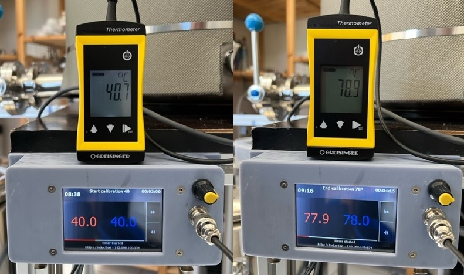
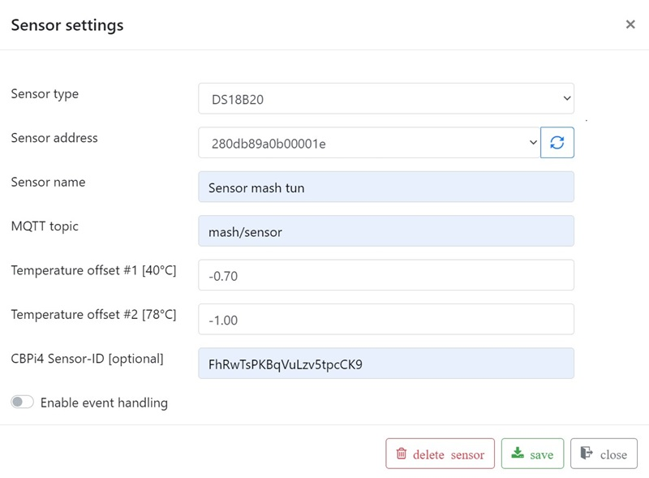
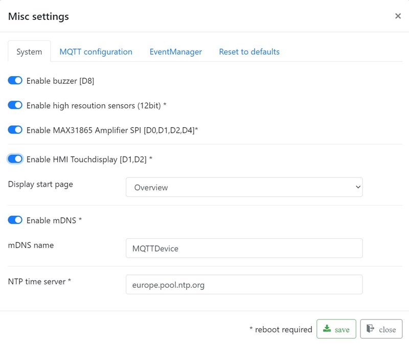
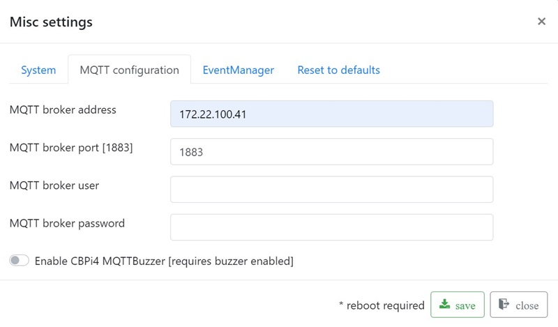

# Using the firmware

Most of the functions of the firmware are self-explanatory. The addition or deletion of sensors and actors is therefore not described here.

## Main functions

    * Adding, editing and deleting sensors
    * Auto reconnect MQTT
    * Auto reconnect WiFi
    * Optional configure HMI touchdisplay
    * Inverted GPIO
    * Firmware and LittleFS updates via file upload
    * Firmware WebUpdate
    * Filebrowser for simple file management (e.g. backup and restore config.json)
    * DS18B20 temperature offset: easy calibration of the sensors

## Sensor calibration

Note: sensor calibration is an optional task. A two-point calibrtation is recommended espacially for mash tune sensors.

The firmware provides an easy option for sensor calibration. Three options availble:

    * no calibration
    
    leave default value 0.0 for offset 1 and offset 2
    
    * single point calibration or constant offset: enter a value for constant offset to offset 1 and set offset 2 to 0.0

    The difference in a single temperture measure is your constant offset 1. There is no predefined temperature for a single point measure.

    * two-point calibration: you need to measure at two predefined temperatures two offsets

A two point calibration provides a more accurate correction of each sensor by re-scaling it at two poinst instad of just one (constant offset). All you need is your mash tune, a calibrated temperature sensor and a cbpi4 mash profil, which includes two mash steps: at 40°C (low mashin temperature) and at 78°C (mashout temperature). Set both mash step timers to something lik 3 to 5 minutes. Fill your mash tune with water. If possible turn on agitator. Now start the two step mash profile in CraftbeerPi4. When temperatur 40°C is reached measure the temperature with a calibrated sensor. The difference between sensor value and calibrated temperatur sensor is offset 1. Repeat measurement when 78°C is reached. The difference is offset 2. In a two-point calibration it is very important to do the first measure at exactly 40°C and the second measure at exactly 78°C!

Calibration example:
Measurement

Sensor setting

## Misc settings

**Piezo Buzzer:**

A piezo buzzer can only be connected to PIN D8. A piezo buzzer is optional. The firmware supports 4 different signals: ON, OFF, OK and ERROR

**HMI display:**

If you want to use a display check jumper settings J1 and J2 first. GPIOs D1 and D2 are used for TX and RX.

**mDNS:**

Multicast DNS is used to resolve hostnames to IP addresses in small networks. A mDNS name can be used instead of the IP address to open the mqttdevice web interface in a browser. Default mDNS name is mqttdevice. Open the configuration panel <http://mqttdevice.local> in your web browser. The name is freely selectable. The mDNS name must be unique in local network and must not contain any spaces or special characters. Please note: if you use two or more MQTTDevices you must change default mDNS "mqttdevice" into an unique identifier! Reboot your mqttdevice after changing mDNS.

**IP address MQTT Server (CBPi):**

On this page you have to enter IP address, Port and credentials of your MQTT broker. In most cases, this is likely to be mosquitto on the CBPi. The default port is 1883.
Important: the firmware MQTTDevice tries constantly to establish a connection with the MQTT broker. If the MQTT broker is not available, this will severely affect the speed of the MQTT device (web interface).

The event manager handles events and misconduct. Handling of malfunctions (event handling) is deactivated in the standard setting!

Events are

* communication with the MQTT server is interrupted
* Suddenly no temperature data is supplied from sensor

Without event handling, the MQTTDevice doesn't do anything automatically. All actor states remain unchanged.

The first thing that will takes place in a misconduct is a delay. Default delay is 120 seconds. Delays are configured for MQTT errors, sensor errors and actors. All actor states remain unchanged during the delay. While WLAN or MQTT communication is interrupted the MQTTDevice tries every 20 seconds to reconnect, regardless of any event handling setting. A successful reconnect will stop a started event delay.
The delays are configured in misc settings in tab EventManager:

1. Delay in MQTT errors
2. Delay for the induction hob before a failed sensor triggers an event
3. Delay for actors before a failed sensor triggers an event

Standard delay is 120 seconds. After the delay, the MQTTdevice can change the status of the actors and induction hob. While actors like heating or cooling element, pumps or agitator can be switched off the induction hob can be set to a (lower) powerlevel, e.g. to 25% power to hold mash temperture while temperature sensor is in error state.
MQTT event handling can generally be activated or deactivated. If MQTT event handling is activated, event handling must also be activated in each sensor and actor settings and for the induction hob. Each device can be configured individually.

Every sensor also has an event handling property. If event handling is activated for a sensor, this sensor can start event handling when sensor connection is lost or sensor state changes into error. A sensor that is deactivated for event handling can not start event handling.

An event handling example:

* Misc settings in tab EventManager: Event handling enabled with default delay 120sec

* Event handling temperature sensor in mash tune is enabled

* Induction hob event handling is enabled and event powerlevel is set to 25%

* Agitator actor event handling is disabled

This easy example prevents the mash kettle from uncontrolled heating, when MQTT connection drops or DS18B20 sensor suddenly reports device unplugged.
