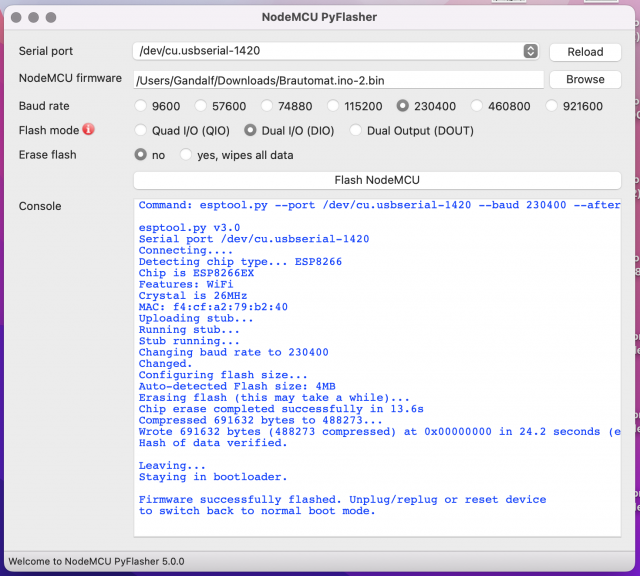

# ▶️ Flash firmware

With the help of esptool.exe (<https://github.com/igrr/esptool-ck/releases>), the firmware can be flashed onto the ESP module. The ESPTool is available for different operating systems.
ESPtool-ck Copyright (C) 2014 Christian Klippel <ck@atelier-klippel.de>. This code is licensed under GPL v2.

The USB driver CH341SER is required under Win10/11: <http://www.wch.cn/download/CH341SER_ZIP.html>

Example for an ESP8266 module of the type Wemos D1 mini with 4MB Flash connected via USB as COM3

* Download the Firmware.zip archive from the tools folder on github and extract it to any folder

  * The archive contains the esptool for flashing, the Flashen.cmd script and the two firmware files

  * Double click on the file Flashen.cmd.

  The firmware is now transfered into MQTTdevice flash.

  *Script flashen.cmd uses port COM3. If COM3 is not the correct port for the Wemos D1 mini, edit flashen.cmd and replace COM3 as required.*

## Manual flash firmware

Linux users must download esptool and flash firmware manual

ESP32 modules:

```bash
esptool.exe -p COM3  --chip esp32 erase_flash
echo Flash firmware and LittleFS 
esptool.exe --chip esp32 --port COM3 --baud 921600  --before default_reset --after hard_reset write_flash  -z --flash_mode dio --flash_freq 80m --flash_size 4MB 0x1000 MQTTDevice32.ino.bootloader.bin 0x8000 MQTTDevice32.ino.partitions.bin 0xe000 boot_app0.bin 0x10000 MQTTDevice32.ino.bin 0x2b0000 MQTTDevice32.mklittlefs.bin
```

ESP8266 modules

```bash
esptool.exe -cp COM3 -cd nodemcu -ce
esptool.exe -cp COM3 -cd nodemcu -ca 0x000000 -cf MQTTDevice.ino.bin -ca 0x200000 -cf MQTTDevice.mklittlefs.bin
```

Change COM3 as required.

## Flash Firmware macOS

Download: [pyflasher](https://github.com/marcelstoer/nodemcu-pyflasher/releases)

Step 1: flash firmware MQTTDevice.ino.bin



Step 2: connect device with your WLAN

Step 3: open file update on MQTTDevice: <http://mqttdevice.local/update> choose filesystem and upload MQTTDevice.mklittlefs.bin

## Configure WLAN

After flashing, the MQTT device starts in access point mode with an open WLAN named "MQTTDevice" and IP address <http://192.168.4.1>


The MQTT device must now be connected to the WLAN.
