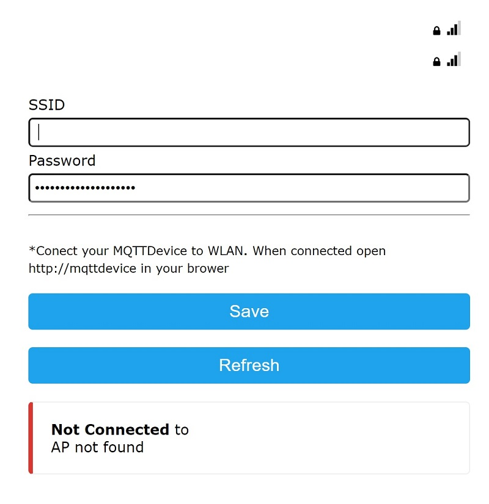

# ▶️ Flash firmware

First download laatest firmware.

[](https://github.com/InnuendoPi/MQTTDevice4/releases/download/Release/Firmware.zip) [](https://github.com/InnuendoPi/MQTTDevice32/releases/download/Release/Firmware.zip)

With the help of esptool.exe (<https://github.com/espressif/esptool>), the firmware can be flashed onto the ESP module. The ESPTool is available for different operating systems. Firmware.ZIP contains ESPTool for windows 64bit. ESPTool is licensed under GPL v2.

[](https://www.wch-ic.com/search?t=all&q=ch341) [](https://www.silabs.com/developers/usb-to-uart-bridge-vcp-drivers?tab=downloads)

Normally a driver for ESP microcontroller connected to an USB Port is found automatically. If no driver is found, download drivers from links above.

* Download the Firmware.zip archive from links above or from github and extract it to any folder

  * The archive contains the esptool for flashing, the Flashen.cmd script and the two firmware files

  * Double click on the file Flashen.cmd.

  The firmware is now transfered into MQTTdevice flash.

## Manual flash firmware

Linux and macOS users must download [esptool](https://github.com/espressif/esptool) and flash firmware manual

ESP32 modules:

```bash
esptool.exe --chip esp32 erase_flash
esptool.exe --chip esp32 --before default_reset --after hard_reset write_flash 0x1000 MQTTDevice32.ino.bootloader.bin 0x8000 MQTTDevice32.ino.partitions.bin 0xe000 boot_app0.bin 0x10000 MQTTDevice32.ino.bin 0x2b0000 MQTTDevice32.mklittlefs.bin
```

ESP8266 modules

```bash
esptool.exe --chip esp8266 erase_flash
esptool.exe --chip esp8266 write_flash MQTTDevice.ino.bin 0x200000 MQTTDevice.mklittlefs.bin
```

## Configure WLAN

After flashing, the MQTT device restarts in access point mode with an open unprotected WLAN named "MQTTDevice" and IP address <http://192.168.4.1>



Configure SSID and password. Klick save and your MQTTDevice connects to your WLAN after another reboot. Now open <http://mqttdevice.local> in your browser.
