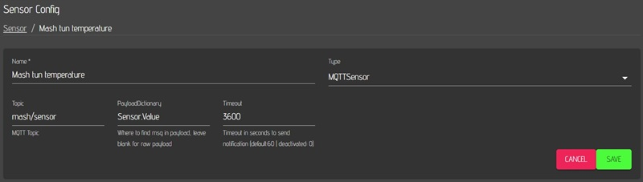
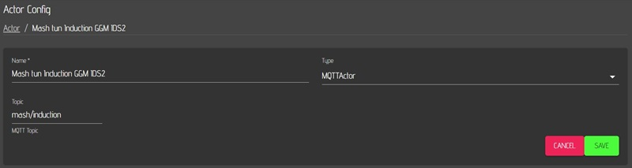

# MQTT CraftbeerPi4

MQTT installation and configuration is described here in detail: <https://openbrewing.gitbook.io/craftbeerpi4_support/readme/craftbeerpi-4-server/mqtt-connectivity>

After CBPi4 restart MQTT is available for sensors and actors

Please note the dot in PayloadDictionary: Sensor.Value (Sensor dot Value)

MQTT mosquitto installtion and configuration for windows is nearly the same. If MQTT actors and sensors are used instead of GPIOs hardware, craftbeerpi4 can be installed on ms windows systems.
