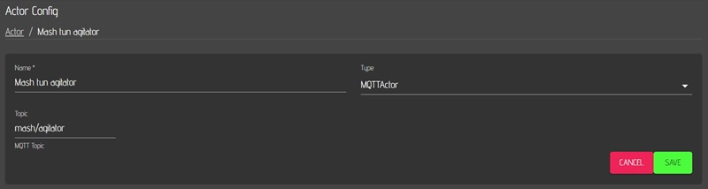

# MQTT CraftbeerPi4

After setup MQTT connectivity for CBPi4 MQTT is available for sensors and actors. Please follow the instructions on CBPi4 gitbook.

Please note the dot in PayloadDictionary: Sensor.Value (Sensor dot Value)

MQTT mosquitto installtion and configuration for windows is nearly the same. If MQTT actors and sensors are used instead of GPIOs hardware, craftbeerpi4 can be installed on Microsoft windows systems.
