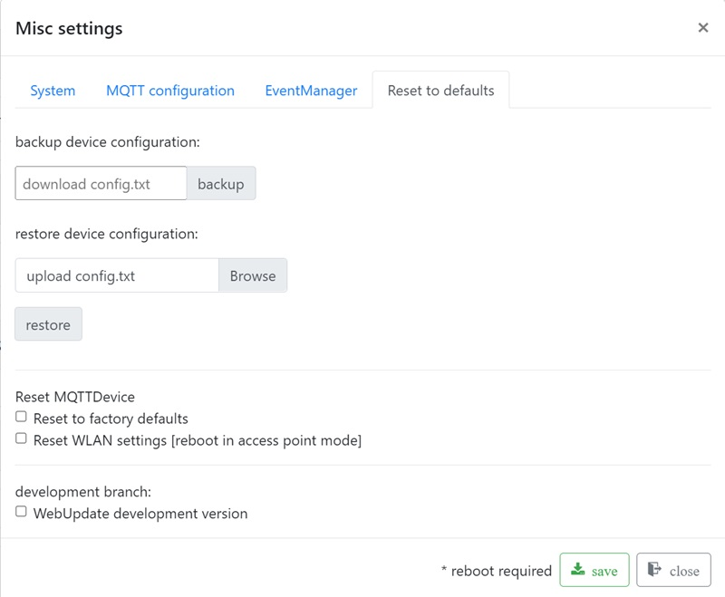
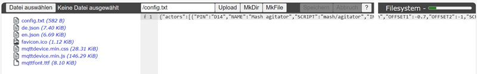

# Backup and Restore

Backup and restore are available via web interface.

It is recommended to make a backup after configuration is completed. MQTT backup files are text files. You can view an edit the configurtion files.

## Explorer

If you want to work with files directly you can use the file explorer. The file explorer can be reached via the web browser <http://mqttdevice/edit>. File explorer offers editor functions. You can check, view and edit files types like txt, json or css. 

File explorer also offers download and upload functions:

1. Download

   Click on the file config.txt (left mouse button) and select download from the popup.

2. Upload

    Click on Select file, select the config.txt from the backup and click on upload
