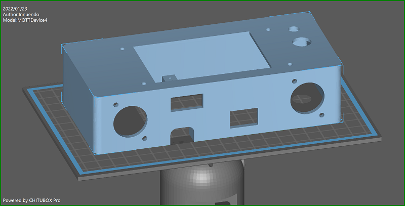
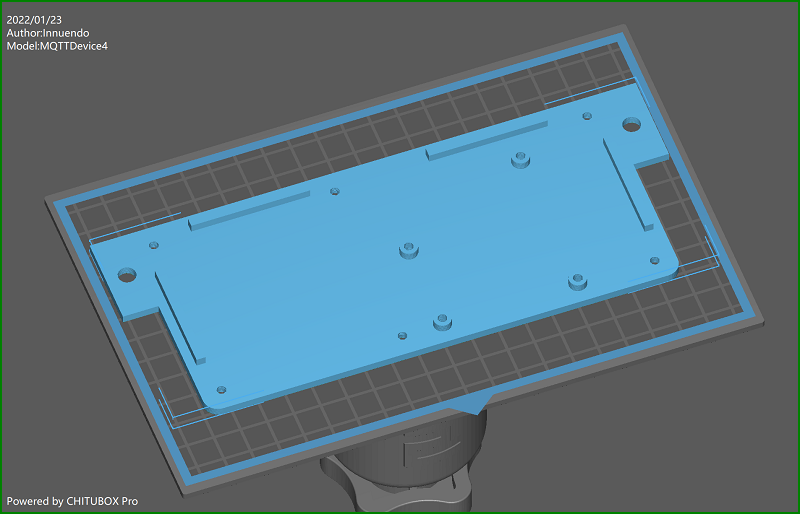
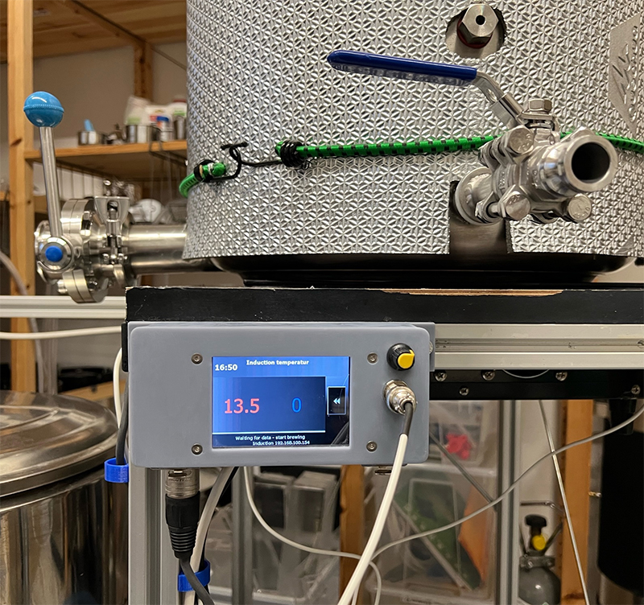

# Case 3D print

3D print files are located in the info folder. With the current housing design, the circuit board and a 3.5" Nextion touchdisplay are glued into the housing. Holes for housing, base and circuit board are made with a diameter for M3 screws. M3x10mm screws fit for display, circuit board and XLR connectors. M3x16 screws match for groundplate to case holes and pads. You need to cut M3 threads into the six pads. Both objects are build parameterized with FreeCAD. Improvments are welcome!

A mash kettle example:

GPIOs D5, D6 and D7 are used by induction hob GGM IDS2. A buzzer is connected to GPIO D8. GPIO D1 and D2 are bound to display. GPIO D4 is used to handle an agitator. The yellow knob is a PWM modul. The connector below shows the cable to the agitator. This MQTTDevice is connected with a 6 cores cable: two lines for 5V power MQTTDevice. Another two lines are used for 24V agitator power, conected to the PWM modul IN. And the last two lines ares used by GPIO D4 + GND and connected to a SSR to switch on/off the agitator power adapter (24V). The PWM modul OUT is connected to the agitator. Both power adapters (MQTTDevice and agitator) are installed on a DIN rail in a central swtich cabinet.
