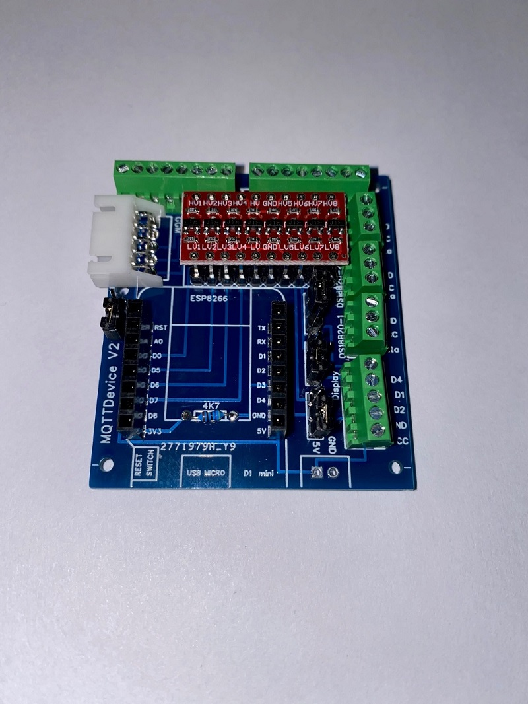
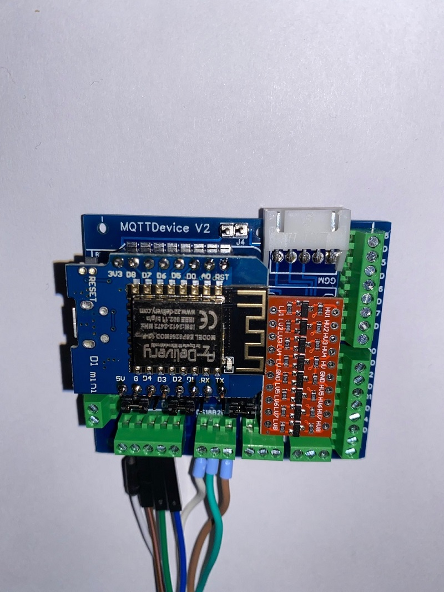
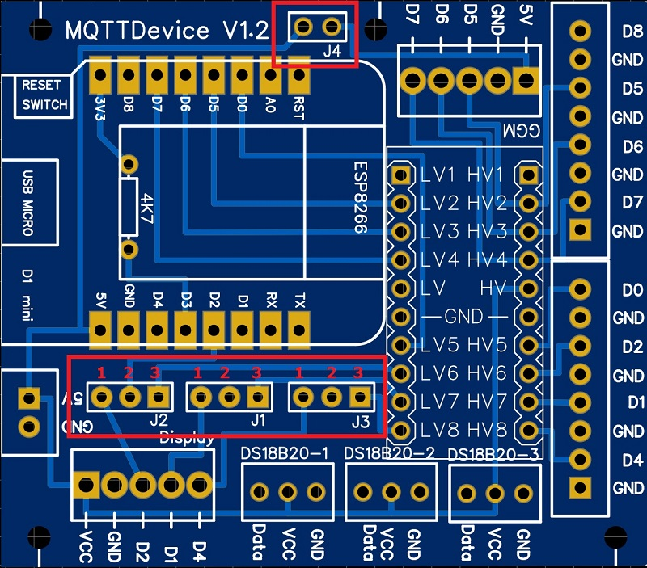
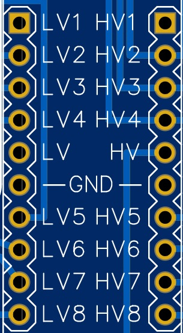

# MQTTDevice circuit board

**Important note:**

The circuit board was created from a hobby project. A fully assembled board is not offered. The project has no commercial intent. The information shared here represents a state of development and is used for further development as well as for checking, correcting and improving. Content from external links (e.g. hobby brewer forum) and information on external content (e.g. articles from well-known providers) are subject to the respective rights of the owner. External content is to be viewed solely as an informative start-up aid.

*All information about the board is purely informative and may be incorrect.*
*Use this information at your own risk. Any liability is excluded.*

 

In this project, a circuit board for the MQTT device was developed in order to offer a simple connection to sensors, actors and the induction hob GGM IDS2 with clamping screw blocks. The board is equipped with only a few components. The board offers the following advantages:

* the Wemos D1 mini is on a base and can be removed at any time.
* all GPIOs are led to screw terminals.
* A LevelShifter provides 5V control voltage to the screw terminals GPIOs (Logic Level Converter).
* The power supply from the Wemos can be used directly from the induction hob when using a GGM IDS2.
* Temperature sensors DS18B20 fixed to D3 can be connected directly to the screw terminals.
* An optional Touchdisplay HMI TFT can be connected using jumpers J1 and J2 via D1 (SDL) and D2 (SDA J2).
* PIN D4 can either be routed to the display port via jumper J3 or to D4 via the LevelShifter.
* PIN D8 is routed to D8 (3V3) without LevelShifter.
* Power supply 5V via screw terminal

**Jumper settings:**

There are 4 jumpers on the board:

1. Jumper J1: PIN D1
    1. In position 1-2, D1 is led to the display connection (SDL)
    2. In position 2-3, D1 is led to connection D1 via the LevelShifter

2. Jumper J2: PIN D2
    1. In position 1-2, D2 is led to the display connection (SDA)
    2. In position 2-3, D2 is led to connection D2 via the LevelShifter

3. Jumper J3: PIN D4
    1. In position 1-2, D4 is led to the display connection as D4, if necessary for a TFT
    2. In position 2-3, D4 is led to connection D4 via the LevelShifter

4. Jumper J4: 5V power connection GGM IDS2
    1. If the jumper is bridged, the 5V power supply from the induction hob (JST-HX socket) is used
    2. If the jumper is not set, the Wemos needs a power supply via the 5V connection
    Jumper J4 is optional. If the GGM IDS2 is not used, the jumper and connection socket can be omitted.

    *If the power supply is drawn from the induction hob (jumper J4 set), no additional voltage supply may be connected via the 5V input.*
    *GPIO0, GPIO2 and GPIO15 map the boot mode for the Wemos D1 Mini. GPIO15 is not connected via the LevelShifter and must be set to low for Flash Boot Mode. GPIO0 and GPIO2 are on high during flash boot*

* Layout circuit board:**

In the Info folder there is an EasyEDA file that can be used to create the circuit board. STL files for a 3D print MQTTDevice housing are also located in the Info folder.
Please share corrections, improvements and further developments.

**Circuit board parts list:**

The following components are required:

| Anzahl | Artikel | ArtikelNr |
| ------ | ------- | --------- |
| 1 | screw terminal block 2pol 2,54 | (eg voelkner S84366) |
| 3 | screw terminal block 3pol 2,54 | (eg voelkner S84893) |
| 2 | screw terminal block 5pol 2,54 | (eg voelkner S84806) |
| 2 | screw terminal block 8pol 2,54 | (eg voelkner S84611) |
| 1 | JST-HX connector 90° 2,54 | (eg voelkner D17526) |
| 1 | Header single row 2,54 | (eg voelkner D19990) |
| 4 | Jumper 2,54 | (eg voelkner S655251) |
| 1 | Resistor 4,7kOhm | (eg voelkner S620751) |
| 1 | D1 mini NodeMcu ESP8266 | [amazon](<https://amzn.to/3RWwyL5>) |
| 1 | LevelShifter 8 Channel 5V 3.3V | [amazon](<https://amzn.to/3xjkN7S>) |

*amazon and voelkner are purely informative as a search aid*
*links are amazon partner and voelkner tradetracker*

When selecting LevelShifter (Logic Level Converter), the assignment must be observed! The LevelShifter must have this order in the Low Voltage (LV) input:

`LV1 - LV2 - LV3 - LV4 - LV (3V3) - Ground - LV5 - LV6 - LV7 - LV8`

**Notes on construction:**

The resistor R 4.7kOhm for the temperature sensors DS18B20 is placed under the Wemos D1 mini. Therefore the Wemos has to be socketed. The sockets also offer the advantage that the Wemos can be removed from the circuit board at any time, e.g. for flashing or testing. The DS18B20 are supplied with 5V at VCC. This ensures a stable supply even with longer supply lines. The resistance is from Data (PIN D3) to 3V3. The JST-HX socket and the J4 jumper for the induction hob are optional.

## Connecting MQTTDevice to induction GGM IDS2

*The following description deletes the guarantee claims for the induction hob*
*Use this manual at your own risk*

The GGM IDS2 induction hob can be connected to the circuit board. The GGM IDS2 is supplied with an external control unit. When the control panel is opened, the cable connection from the control panel to the induction hob can be removed. All you have to do is pull the cable out of the socket in the control panel.
The same socket (JST-HX) is located on the MQTTDevice board. This makes the electrical connection very easy.

The connections must be configured via the web interface:

* PIN White (relay) connected to PIN D7 (Interrupt!)
* PIN Yellow (Command Channel) connected to pin D6
* PIN Blue (back channel) connected to pin D5

A separate power supply is not required for the MQTT device when using the GGM IDS2. GPIOs D5, D6 and D7 are strongly recommended!

## Connecting sensors DS18B20

Temperature sensors of type DS18B20 with 3 connection cables (data, VCC and GND) are supported. Temperature sensors are tied to D3. The necessary resistance 4k7 to 3V3 is provided on the board. The voltage supply for the temperature sensors is connected to 5V.

## Connecting relais boards

In addition to a GPIO, relay boards require a 5V power supply. 5V can be tapped at one of the three connections for the temperature sensors DS18B20 at VCC and GND.
