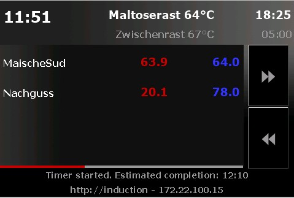
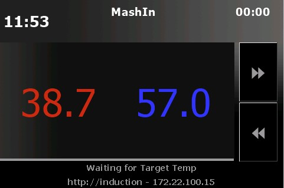
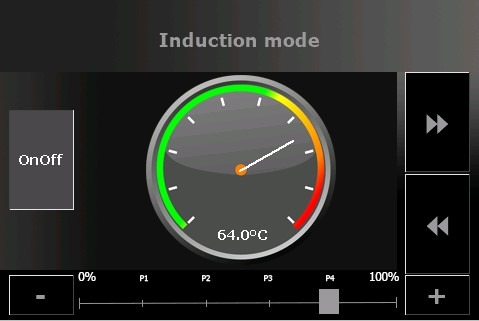
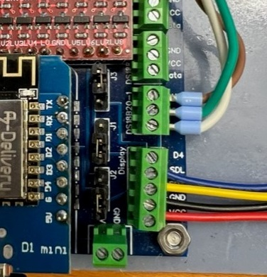

# Touchdisplay

This firmware supports Nextion Touchdisplay HMI TFT 3.5" NX4832T035 (basic series), NX4832K035 (enhanced series) an NX4832F035 (discovery series). Three pages are availible:

Mode BrewPage: max 4 CBPi kettles overview

Mode KettlePage: current and target temperature

Attention: you must enter sensors IDs from CraftbeerPi4 in the sensor configuration page. Otherwise displayed tempertures may be wrong or mixed up between different sensors.

InductionPage: manual induction hob controller

BrewPage is usefull while brewing. When your mash process completed the use of BrewPage (overview) ends. The Kettlepage can be used any time as a kettle temperature information pannel. The induction mode can be usefull beside automated brew. Instead the InductionPage offers manual control of your induction cooker. The display can be configured via the WebIf. While display is activated, GPIO D1 (SDL) and D2 (SDA) are in use (software serial tx/rx).

Files naming:
MQTTDevice4-Display_\<displaysize\>

Please note: github repository also provide 2,8" Display files. These files are shared by MQTTDevice users. These files are untested - i do not have other displays than 3.5".

**Instructions to flash NextionsX2 touchdisplay:**

Copy the file info/mqttdevice4-\<displaytype>.tft in the root directory of your SD card. Put your SD card into the cardreader of your Nextion display and power on. The MQTTDevice display template will be flashed. When finished power off and remove SD card.

**Connect NextionsX2 touchdisplay:**

Please check the manual of your display first! Use this information on your own risk!

Nextion red cable power+ plugged into screw terminal display port Vcc

Nextion black cable power- plugged into screw terminal display port GND

Nextion blue cable TX plugged into screw terminal display port D1 (SDL)

Nextion yellow cable RX plugged into screw terminal display port D2 (SDA)
