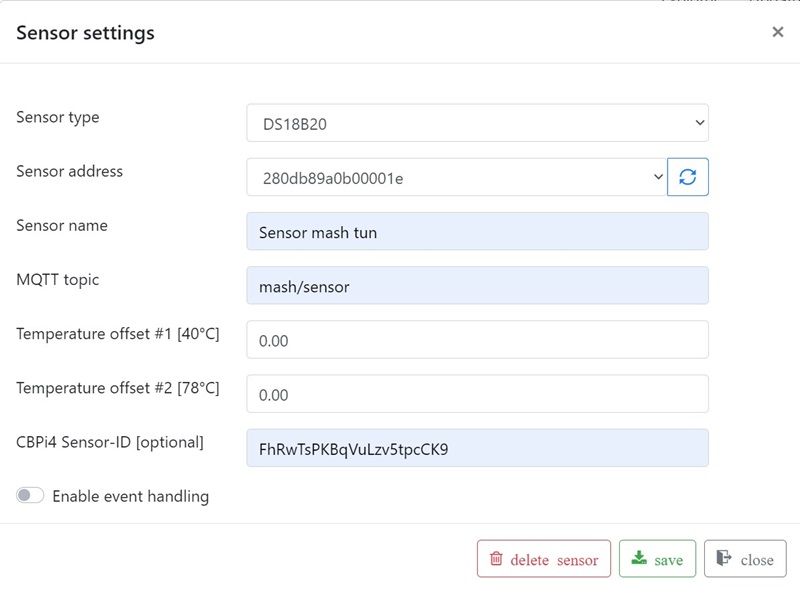
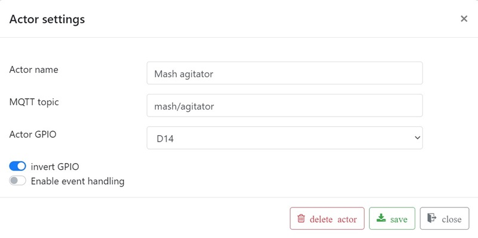

# Installation

The installation is divided into three steps:

1. Installation of RaspberryPi and CraftbeerPi4
2. Installation MQTT Broker
3. Installation MQTTDevice

The installation and configuration of CraftbeerPi4 is described here: <https://openbrewing.gitbook.io/craftbeerpi4_support/master/server-installation>
You will need version 4.0.1.11 or above. Earlier versions do not support MQTT actors.

The installation and configuration of RaspberryPi is available in many good instructions on the internet.

The communication between CraftbeerPi and MQTTDevice takes place via WLAN. Sensors send temperature values ​​to CraftbeerPi and CraftbeerPi sends commands to actors (e.g. switch agitator on / off). The MQTT protocol is used for this communication. The MQTT protocol requires a MQTT broker.

The MQTT sensor "Induction temperature" and the MQTT actor "Agitator" are now created on the MQTTdevice with the identical CBPi4 topics:

The sensor or actor name can be different. These steps complete the exemplary installation and configuration of MQTT sensors and actors. Up to 6 sensors and 8 actors can be set up per MQTT device. (Almost) any number of MQTT devices can be connected to CraftbeerPi via MQTT. Three MQTT devices are used very often:

MQTTDevice 1: Mash tun with temperature sensors and agitator.

MQTTDevice 2: HLT with temperature sensors, pumps and valves etc.

MQTTDevice 3: Fermenter with temperature sensors, an actor for heating and an actor for cooling

Any combination is possible. Because the MQTT communication is implemented via topics, a temperature sensor and an induction hob for a CraftbeerPi Kettle do not have to be configured on the same MQTTDeivce.

The picture above is an example on how to configure an induction hob GGM IDS2. Do not reduce fan run on after power off below 120sec: savely cool down induction hob after mash or boil. GPIOs D5, D6 and D7 are highly recommended. Check ESP8266 manual for further information about GPIO states (High/Low) on startup.
