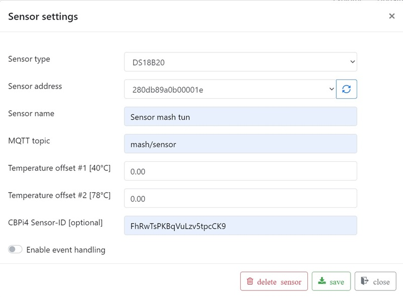
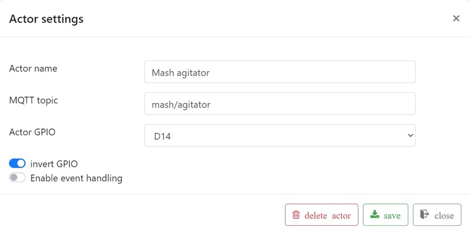
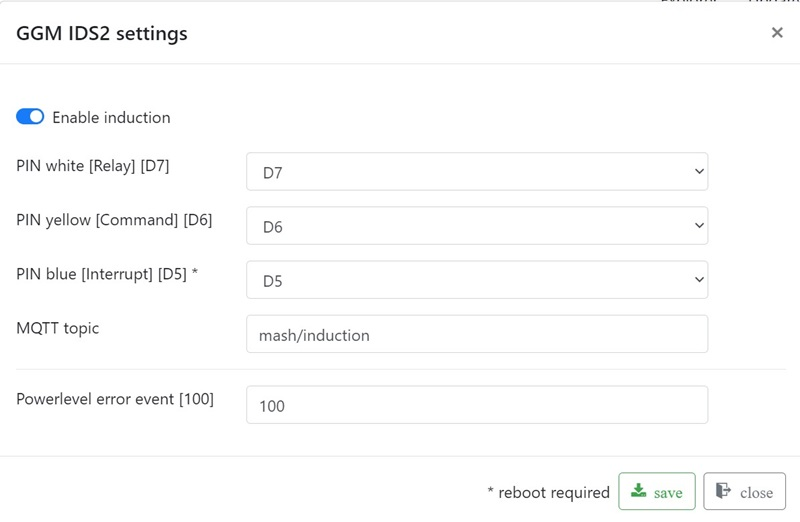

# Setup sensors and actors

The MQTT sensor "mash tun temperature" and the MQTT actors "mash tun induction" and "mash tun agitator" are now created on the MQTTdevice with exactly the same CBPi4 topics:

_Note: sensor and actor names can be different between CBPi4 and MQTTDevice, but MQTT topics must be exactly equal. MQTT topics are case sensitive._

The picture MQTT induction is an example on how to configure the induction hob GGM IDS2. GPIOs D5, D6 and D7 are recommended.
